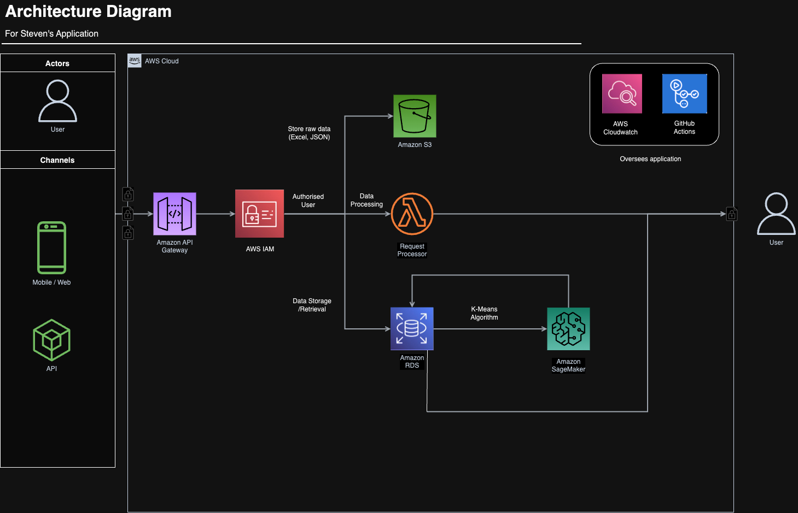

# 1. Introduction
Steven, a travel blogger, is embarking on a travel food series project. He intends to analyse data from Zomato to find restaurants with good user ratings and interesting past events. 

My task is to assist Steven in extracting and analysing the necessary data from the provided JSON and Excel files.

# 2. Requirements
**Operating Systems**: Compatible with Windows and MacOS <br/>
**Python Version**: 3.12.2 <br/>
**Required libraries**: (in requirements.txt)
- pandas
- numpy
- scikit-learn

# 3. Setup Instructions

### a. Cloning the repo
```
git clone https://github.com/cliftonchee/govtech_cc4
```

### b. Running the application
```
cd govtech_cc4
pip install -r requirements.txt
python main.py
```

# 4. Architecture Diagram


# 5. Considerations
[Link to Considerations](docs/considerations.md)

# 6. Running unit tests

There are 2 unit tests in the `tests` folder to test the output of the April 2019 result.

```python
cd tests
python test_null.py # or test_apr_2019.py
```

